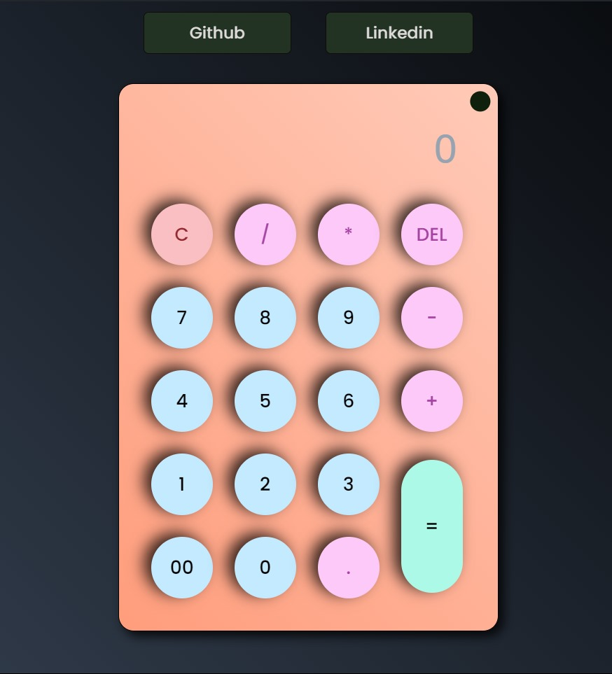
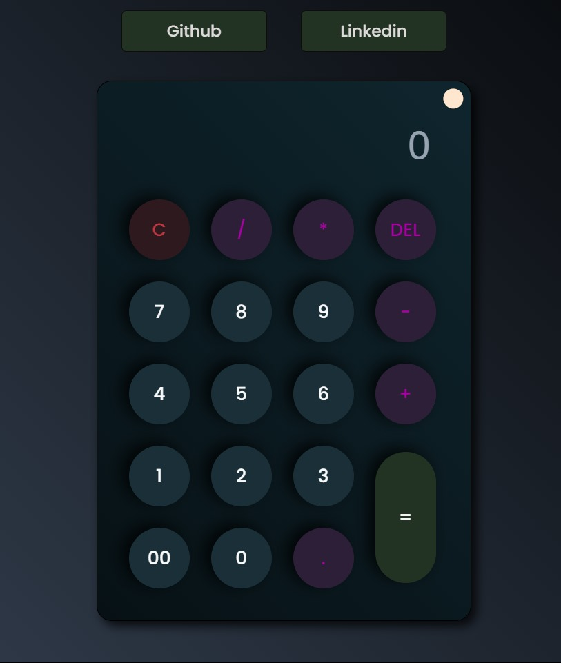

# Calculator

A simple and elegant calculator application with support for both light and dark modes.

## Features

- Basic arithmetic operations: addition, subtraction, multiplication, and division
- Light and dark mode toggle
- Responsive design
- User-friendly interface

## Screenshots

### Light Mode

### Dark Mode

## Usage

- Click the buttons to perform basic arithmetic operations.
- Use the `C` button to clear the input.
- Use the `DEL` button to delete the last entered character.
- Click the `=` button to get the result.
- Toggle between light and dark modes using the theme toggle button.

## Technologies Used

- HTML
- CSS
- JavaScript
